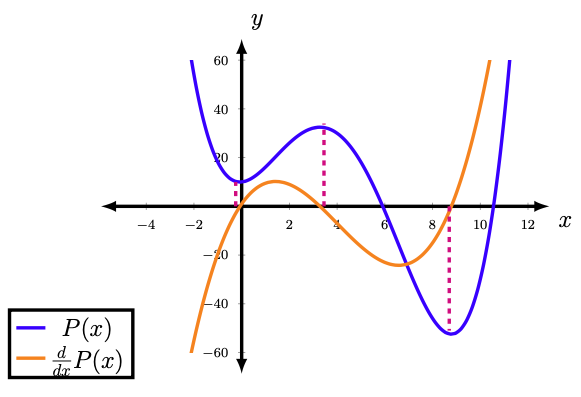

# Journée d'Immersion / Day of Immersion

# Programming in the Cloud: Roots of Polynomials
Download the [Handout](polynomials.pdf)

# Overview

In this atelier you will experiment with software development
in the cloud using GitHub and the Python programming language.

You will finish the development of a program which will compute the
roots of polynomials of degree 1 through 5.

The suite of Python functions you will implement (finish the
implementation of) are designed to review your mastery of

   - Polynomials
   - Factorization
   - Quadratic formula
   - Finding Extrema using the Derivative
   - and more

